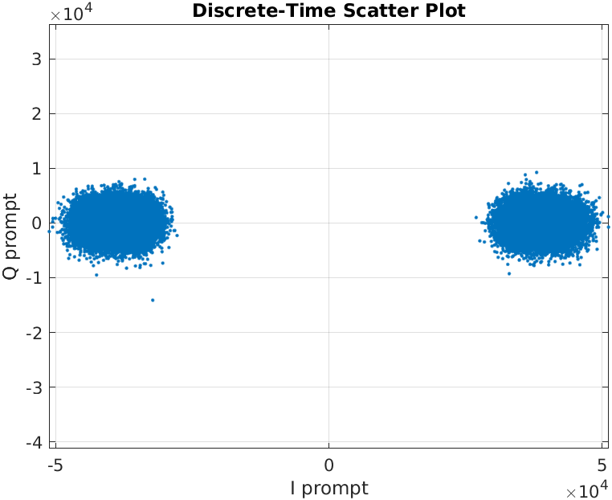
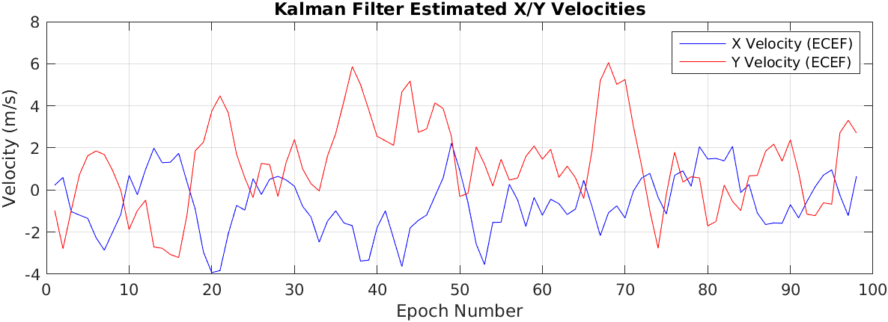

# GNSS Signal Processing and Positioning Analysis Report（AAE6102 Assignment 1）
### by MO Longfei 23125334R

> *Preface: This report's implementation is based on the open-source repository SOFTGNSSv3.0 (https://github.com/TMBOC/SoftGNSS). The report structure, organization, and refinement were assisted by Claude Sonnet 3.7. 

## Task 1 - Signal Acquisition

### 1.1 Acquisition Methodology

Signal acquisition employs the **parallel code phase search** algorithm, accelerated through FFT-based correlation:

1. **Signal Preprocessing & Segmentation** - from `acquisition.m`:
```matlab
% Create two 1ms signal segments for correlation
signal1 = longSignal(1 : samplesPerCode);
signal2 = longSignal(samplesPerCode+1 : 2*samplesPerCode);

% Remove DC bias from signal
signal0DC = longSignal - mean(longSignal);   
```

2. **Frequency Search Grid Generation** - from `acquisition.m`:
```matlab
% Generate frequency search grid (500Hz steps)
for frqBinIndex = 1:numberOfFrqBins
    frqBins(frqBinIndex) = settings.IF - settings.acqSearchBand + 0.5e3 * (frqBinIndex - 1);
end
```

3. **C/A Code Generation and FFT Transformation** - from `acquisition.m` and `makeCaTable.m`:
```matlab
% Generate and sample all satellites' C/A codes
caCodesTable = makeCaTable(settings);

% Transform current satellite PRN code to frequency domain
caCodeFreqDom = conj(fft(caCodesTable(PRN, :)));
```

4. **Frequency Domain Correlation** - from `acquisition.m`:
```matlab
% Carrier generation and down-conversion
sigCarr = exp(1i*frqBins(frqBinIndex) * phasePoints);
I1 = real(sigCarr .* signal1);
Q1 = imag(sigCarr .* signal1);
I2 = real(sigCarr .* signal2);
Q2 = imag(sigCarr .* signal2);

% Frequency domain multiplication for time-domain correlation
IQfreqDom1 = fft(I1 + 1i*Q1);
IQfreqDom2 = fft(I2 + 1i*Q2);
convCodeIQ1 = IQfreqDom1 .* caCodeFreqDom;
convCodeIQ2 = IQfreqDom2 .* caCodeFreqDom;
acqRes1 = abs(ifft(convCodeIQ1));
acqRes2 = abs(ifft(convCodeIQ2));
```

5. **Signal Detection and Decision** - from `acquisition.m`:
```matlab
% Find correlation peaks
[~, frequencyBinIndex] = max(max(results, [], 2));
[peakSize, codePhase] = max(max(results));

% Find second highest peak and calculate peak ratio
secondPeakSize = max(results(frequencyBinIndex, codePhaseRange));
acqResults.peakMetric(PRN) = peakSize/secondPeakSize;

% Determine signal presence
if (peakSize/secondPeakSize) > settings.acqThreshold
    % Signal detected successfully
    fprintf('%02d ', PRN);
    % Perform fine frequency estimation
end
```

6. **Fine Frequency Estimation** - from `acquisition.m`:
```matlab
% Generate 10ms-long C/A code
caCode = generateCAcode(PRN);
codeValueIndex = floor((ts * (1:10*samplesPerCode)) / (1/settings.codeFreqBasis));
longCaCode = caCode((rem(codeValueIndex, 1023) + 1));

% Remove code modulation to obtain pure carrier
xCarrier = signal0DC(codePhase:(codePhase + 10*samplesPerCode-1)) .* longCaCode;

% High-precision FFT frequency estimation
fftNumPts = 8*(2^(nextpow2(length(xCarrier))));
fftxc = abs(fft(xCarrier, fftNumPts)); 
```

### 1.2 Parameter Analysis

| Parameter         | Urban Value | Opensky Value | Function & Impact                                                     |
| ----------------- | ----------- | ------------- | --------------------------------------------------------------------- |
| `samplingFreq`    | 26 MHz      | 58 MHz        | Sampling frequency, affects signal resolution and processing load     |
| `IF`              | 0 Hz        | 4.58 MHz      | Intermediate frequency, impacts downconversion strategy               |
| `acqSearchBand`   | ±8 kHz      | ±7 kHz        | Doppler search range, affects acquisition speed and success rate      |
| `acqThreshold`    | 1.5         | 1.5           | Signal detection threshold, balances sensitivity and false alarm rate |
| `codeFreqBasis`   | 1.023 MHz   | 1.023 MHz     | C/A code base frequency, GPS L1 standard                              |
| `codeLength`      | 1023 chips  | 1023 chips    | C/A code length, GPS L1 standard                                      |
| `samplesPerCode`  | ~26000      | ~57680        | Samples per C/A code, affects correlation precision                   |
| `numberOfFrqBins` | 33          | 29            | Number of frequency search bins, influences acquisition resolution    |

The Urban environment uses zero-IF sampling to simplify processing, though this can be affected by DC offset. In contrast, the Opensky environment employs non-zero IF to avoid low-frequency interference. Urban settings feature a wider search bandwidth to accommodate potentially larger Doppler shifts in complex urban environments.

### 1.3 Acquisition Results Visualization

The acquisition results display each satellite's acquisition metric (ratio between highest and second-highest correlation peaks):

- X-axis: Satellite PRN numbers (1-32)
- Y-axis: Acquisition metric (ratio of highest to second-highest correlation peak)
- Green bars: Successfully acquired satellites
- Blue bars: Satellites below acquisition threshold

#### Open-sky Environment Acquisition Results


**Figure 1.1** Open-sky environment acquisition results. Green bars represent successfully acquired satellites (PRNs 16, 22, 26, 27, 31), with acquisition metrics significantly exceeding the 1.5 threshold, indicating excellent signal quality and high acquisition reliability in open environments.

#### Urban Environment Acquisition Results


**Figure 1.2** Urban environment acquisition results. Compared to open-sky conditions, fewer satellites were acquired (PRNs 1, 3, 11, 18), and acquisition metrics were generally lower, reflecting the impact of building obstructions in urban environments on signal quality.

## Task 2 - Signal Tracking

### 2.1 Tracking Methodology

Signal tracking incorporates both code tracking loops (DLL) and carrier tracking loops (PLL):

1. **Local Carrier Generation** - from `tracking.m`:
```matlab
% Generate carrier based on estimated phase
carrierValue = exp(1i * (2 * pi * remCarrPhase));
qBasebandSignal = real(carrierValue .* rawSignal);
iBasebandSignal = imag(carrierValue .* rawSignal);
```

2. **Early-Prompt-Late Code Generation** - from `tracking.m`:
```matlab
% Generate prompt code
tcode = remCodePhase : codePhaseStep : ((blksize-1)*codePhaseStep+remCodePhase);
tcode2 = ceil(tcode) + 1;
promptCode = caCode(tcode2);

% Early code
tcode = (remCodePhase-earlyLateSpc) : codePhaseStep : ((blksize-1)*codePhaseStep+remCodePhase-earlyLateSpc);
tcode2 = ceil(tcode) + 1;
earlyCode = caCode(tcode2);

% Late code
tcode = (remCodePhase+earlyLateSpc) : codePhaseStep : ((blksize-1)*codePhaseStep+remCodePhase+earlyLateSpc);
tcode2 = ceil(tcode) + 1;
lateCode = caCode(tcode2);
```

3. **Correlator Computation** - from `tracking.m`:
```matlab
% Compute I and Q components for early, prompt, and late correlators
I_E = sum(earlyCode .* iBasebandSignal);
Q_E = sum(earlyCode .* qBasebandSignal);
I_P = sum(promptCode .* iBasebandSignal);
Q_P = sum(promptCode .* qBasebandSignal);
I_L = sum(lateCode .* iBasebandSignal);
Q_L = sum(lateCode .* qBasebandSignal);
```

4. **Discriminator Implementation** - from `tracking.m`:
```matlab
% Code loop discriminator (non-coherent early-late)
codeError = (sqrt(I_E*I_E + Q_E*Q_E) - sqrt(I_L*I_L + Q_L*Q_L)) / (sqrt(I_E*I_E + Q_E*Q_E) + sqrt(I_L*I_L + Q_L*Q_L));

% Carrier loop discriminator (Costas loop)
carrError = atan(Q_P / I_P) / (2.0 * pi);
```

5. **Loop Filtering** - from `tracking.m`:
```matlab
% Code loop filter
codeNco = oldCodeNco + (tau2code/tau1code) * (codeError - oldCodeError) + codeError * (PDIcode/tau1code);

% Carrier loop filter
carrNco = oldCarrNco + (tau2carr/tau1carr) * (carrError - oldCarrError) + carrError * (PDIcarr/tau1carr);
```

### 2.2 Multi-correlator Implementation

To analyze correlation peak shapes, multiple correlators (0.1 chip spacing) are implemented - from `tracking.m`:

```matlab
% Generate multiple correlators from -0.5 to 0.5 chips
tcode = (remCodePhase-0.4) : codePhaseStep : ((blksize-1)*codePhaseStep+remCodePhase-0.4);
tcode2 = ceil(tcode) + 1;
earlyCode04 = caCode(tcode2);

tcode = (remCodePhase-0.3) : codePhaseStep : ((blksize-1)*codePhaseStep+remCodePhase-0.3);
tcode2 = ceil(tcode) + 1;
earlyCode03 = caCode(tcode2);

// ...existing code...

% Calculate multi-correlator results
I_E04 = sum(earlyCode04 .* iBasebandSignal);
Q_E04 = sum(earlyCode04 .* qBasebandSignal);
// ...existing code...
```

### 2.3 Parameter Analysis

| Parameter              | Urban Value | Opensky Value | Function & Impact                                                          |
| ---------------------- | ----------- | ------------- | -------------------------------------------------------------------------- |
| `dllCorrelatorSpacing` | 0.5 chips   | 0.5 chips     | Early-late correlator spacing, affects code tracking precision             |
| `dllDampingRatio`      | 0.707       | 0.707         | Code loop damping ratio, affects loop stability                            |
| `dllNoiseBandwidth`    | 1.5 Hz      | 1.5 Hz        | Code loop noise bandwidth, balances dynamic response and noise suppression |
| `pllDampingRatio`      | 0.707       | 0.707         | Carrier loop damping ratio                                                 |
| `pllNoiseBandwidth`    | 25 Hz       | 25 Hz         | Carrier loop noise bandwidth                                               |
| `multicorr`            | 1           | 1             | Multi-correlator flag, 1 = enabled                                         |

Tracking parameters for Urban and Opensky environments are nearly identical, indicating a consistent tracking strategy across environments. This allows direct comparison of environment effects on tracking performance.

### 2.4 Tracking Results Visualization

The tracking performance is visualized through multiple plots from `plotTracking.m`:

#### Open-sky Environment Tracking Results (PRN 16)

##### I/Q Scatter Plot


**Figure 2.1a** Open-sky environment I/Q scatter plot for PRN 16. Points cluster compactly along the positive I-axis, indicating excellent carrier phase locking and stable tracking.

##### Correlator Outputs


**Figure 2.1b** Open-sky environment correlator outputs for PRN 16. Early code (blue), prompt code (green), and late code (red) correlators form a clear triangular structure with the prompt correlator significantly higher than early and late correlators, indicating precise code phase locking with minimal multipath interference.

##### Carrier Tracking Performance


**Figure 2.1c** Open-sky environment filtered PLL discriminator output for PRN 16. The curve shows minimal fluctuation around zero, indicating stable carrier tracking with well-controlled phase errors.

##### Signal Strength


**Figure 2.1d** Open-sky environment carrier-to-noise ratio (C/N0) for PRN 16. C/N0 maintains a high level around 45dB-Hz, indicating excellent signal quality conducive to stable tracking.

#### Urban Environment Tracking Results (PRN 1)

##### I/Q Scatter Plot


**Figure 2.2a** Urban environment I/Q scatter plot for PRN 1. Points are widely dispersed without clear alignment along the I-axis, indicating unstable carrier phase locking and tracking errors.

##### Correlator Outputs


**Figure 2.2b** Urban environment correlator outputs for PRN 1. Compared to open-sky conditions, the correlation peak shape shows significant distortion, with reduced amplitude differences between early/late and prompt correlators. The asymmetric triangular structure indicates substantial multipath interference affecting code tracking precision.

##### Carrier Tracking Performance


**Figure 2.2c** Urban environment filtered PLL discriminator output for PRN 1. The curve shows large fluctuations frequently deviating from zero, indicating unstable carrier tracking significantly affected by multipath and signal attenuation.

##### Signal Strength


**Figure 2.2d** Urban environment carrier-to-noise ratio (C/N0) for PRN 1. C/N0 is notably lower than in open-sky conditions and exhibits significant fluctuations, averaging around 35-40dB-Hz, reflecting reduced signal quality due to obstructions and multipath effects.

### Multi-correlator Autocorrelation Function Comparison

#### Open-sky Environment Multi-correlator Results


**Figure 2.3** Open-sky environment multi-correlator autocorrelation function. The curve exhibits a symmetric triangular shape with a pronounced, centered peak, indicating negligible multipath interference.

#### Urban Environment Multi-correlator Results


**Figure 2.4** Urban environment multi-correlator autocorrelation function. The curve shows asymmetry, peak offset, and shape distortion, clearly affected by multipath effects that lead to increased pseudorange measurement errors.

### Impact of Urban Interference on Correlation Peaks

Comparing the multi-correlator results between open-sky and urban environments reveals significant effects of urban interference on correlation peaks:

1. **Peak Asymmetry**: The multi-correlator analysis shows that the autocorrelation function (ACF) in urban environments is significantly asymmetric, unlike the perfectly symmetric triangular shape observed in open-sky environments. This asymmetry directly indicates that multipath distorts the ACF shape, leading to incorrect pseudorange measurements.

2. **Peak Distortion**: The correlation peak in open-sky environments is sharp, clear, and centered, while the urban environment shows noticeable shape distortion, directly affecting code tracking precision.

3. **Signal-to-Noise Degradation**: Urban correlation peaks exhibit relatively lower amplitude and reduced peak-to-noise ratio compared to the high signal-to-noise ratio in open environments, reflecting the impact of urban multipath on signal quality.

4. **Tracking Stability Issues**: The PLL output in urban settings is not consistently near zero and shows significant increases at times, indicating unstable carrier tracking. This instability relates directly to correlation peak distortion.

The multi-correlator implementation clearly visualizes these interference effects, providing valuable insights into signal degradation mechanisms in challenging urban environments.

## Task 3 - Navigation Data Decoding

### 3.1 Decoding Methodology

Navigation data decoding extracts navigation information by analyzing the I_P channel data:

1. **Data Synchronization and Preamble Detection** - from `NAVdecoding.m` and `postNavigation.m`:
```matlab
% Detect navigation data frame synchronization in tracking results
[eph(PRN), subFrameStart(channelNr), TOW(channelNr)] = NAVdecoding(trackResults(channelNr).I_P);
```

2. **Navigation Data Bit Extraction** - from `NAVdecoding.m`:
```matlab
% Frame synchronization and navigation bit extraction
for i = 1:5
    % Get subframe data
    subframe = navBitsSamples(subFrameStart + (i-1)*1500 : subFrameStart + i*1500 - 1);
    
    % Perform bit synchronization and navigation message decoding
    [subframeData, status] = CNAVdecoding(subframe,i);
    
    if status == true
        % Navigation message successfully decoded
        // ...existing code...
    end
end
```

3. **Ephemeris Parameter Extraction** - from `CNAVdecoding.m`:
```matlab
% Extract parameters from different subframes
switch subframeID
    case 1
        % Subframe 1 - Week number, accuracy, health status, etc.
        eph.weekNumber = bin2dec(navBitsBin(61:70));
        eph.accuracy = bin2dec(navBitsBin(73:76));
        eph.health = bin2dec(navBitsBin(77:82));
        // ...existing code...
    case 2
        % Subframe 2 - Orbital parameters
        eph.IODE_sf2 = bin2dec(navBitsBin(61:68));
        eph.Crs = twosComp2dec(navBitsBin(69:84)) * 2^-5;
        eph.deltaN = twosComp2dec(navBitsBin(91:106)) * 2^-43 * pi;
        // ...existing code...
end
```

4. **Data Integrity Check** - from `postNavigation.m`:
```matlab
% Check ephemeris data integrity
if (isempty(eph(PRN).IODC) || isempty(eph(PRN).IODE_sf2) || isempty(eph(PRN).IODE_sf3) || ...
    (eph(PRN).IODE_sf2 ~= eph(PRN).IODE_sf3) || ...
    (eph(PRN).IODC(1:8) ~= eph(PRN).IODE_sf2))
    eph(PRN) = [];
end
```

### 3.2 Parameter Analysis

| Parameter         | Description                | Typical Value/Setting                                             |
| ----------------- | -------------------------- | ----------------------------------------------------------------- |
| `skipAcquisition` | Skip acquisition flag      | 0 (don't skip)                                                    |
| `msToProcess`     | Processing duration in ms  | 50000ms (at least 36000ms needed for complete navigation message) |
| `navSolPeriod`    | Navigation solution period | 500ms                                                             |
| `elevationMask`   | Elevation mask             | 5°                                                                |

Navigation message decoding requires sufficient data recording duration (at least 36 seconds) to ensure complete navigation subframes are received. The settings specify 50000ms processing time to ensure complete navigation message reception.

### 3.3 Navigation Data Visualization

Navigation data visualization results include:
1. Navigation bit sequence - Raw bit stream
2. Ephemeris parameter table - Satellite ephemeris data containing 31 parameters

#### Open-sky Environment Navigation Data (PRN 16)


**Figure 3.1** Open-sky environment navigation data bit stream for PRN 16. Clear bit transitions are visible with stable signal amplitude, facilitating accurate navigation message decoding.

#### Urban Environment Navigation Data (PRN 1)


**Figure 3.2** Urban environment navigation data bit stream for PRN 1. Compared to open-sky conditions, bit transitions are less distinct and signal amplitude is unstable, increasing navigation message decoding difficulty and error rate.

*Note: Ephemeris data for open-sky and urban environments are saved in Opensky_Ephemeris_data.mat and Urban_Ephemeris_data.mat respectively.*

## Task 4 - Position and Velocity Estimation

### 4.1 Estimation Methodology

Position and velocity estimation utilizes the Weighted Least Squares (WLS) method:

1. **Pseudorange Calculation** - from `calculatePseudoranges.m`:
```matlab
% Calculate pseudoranges
[navSolutions.rawP(:, currMeasNr), transmitTime, localTime] = calculatePseudoranges(trackResults, subFrameStart, TOW, currMeasSample, localTime, activeChnList, settings);
```

2. **Doppler Calculation** - from `calculateDoppler.m`:
```matlab
% Calculate Doppler shift
for channelNr = channelList 
    % Find current measurement point location
    for index = 1: length(trackResults(channelNr).absoluteSample)
        if(trackResults(channelNr).absoluteSample(index) > currMeasSample)
            break
        end 
    end
    index = index - 1;
    carrFreq = trackResults(channelNr).carrFreq(index);
    doppler(channelNr) = (carrFreq-settings.IF)*settings.c/1575.42e6; % m/s
end
```

3. **Satellite Position Calculation** - from `satpos.m`:
```matlab
% Calculate satellite positions from ephemeris
[satPositions, satClkCorr] = satpos(transmitTime(activeChnList), [trackResults(activeChnList).PRN]', eph, settings);
```

4. **Pseudorange Correction** - from `leastSquarePos.m`:
```matlab
% Apply satellite clock corrections
clkCorrRawP = navSolutions.rawP(activeChnList, currMeasNr)' + satClkCorr * settings.c;
```

5. **Position Estimation (WLS)** - from `leastSquarePos.m`:
```matlab
% Weighted least squares iterative solution
for iter = 1:settings.nmbOfIterations
    % Calculate geometry matrix A and residual vector omc
    [A, omc] = calculateA_And_omc(...);
    
    % Elevation-based weighting
    weight(i) = sin(el(i))^2;
    W = diag(weight);
    C = W'*W;
    
    % Solve position update
    x = (A'*C*A)\(A'*C*omc);
    X = X + x;
end
```

6. **Velocity Estimation (WLS)** - from `leastSquareVel.m`:
```matlab
% Doppler-based velocity estimation
rate = -lamda*doppler;
for i=1:nmbOfSatellites
    b(i) = rate(i)-satvelocity(i,:)*(A(i,1:3))';
end
v = (A'*C*A)\(A'*C*b');
```

### 4.2 Parameter Analysis

| Parameter          | Description                | Typical Value/Setting |
| ------------------ | -------------------------- | --------------------- |
| `c`                | Speed of light             | 299792458 m/s         |
| `nmbOfIterations`  | Number of iterations       | 7 (WLS iteration)     |
| `navSolPeriod`     | Navigation solution period | 500ms                 |
| `useTropCorr`      | Tropospheric correction    | 1 (enabled)           |
| `measurementNoise` | Measurement noise variance | 25^2(625)             |

Position estimation employs elevation-based weighted least squares, assigning higher weights to satellites at higher elevation angles to reduce multipath and atmospheric errors. Velocity estimation uses Doppler shift derived from carrier frequency estimates to calculate receiver velocity.

### 4.3 Position and Velocity Visualization

#### Open-sky Environment Results

##### Geographic Position Visualization


**Figure 4.1a** Open-sky environment geographic position visualization. Red markers represent estimated positions, and yellow markers indicate true reference positions. Estimated positions closely match true positions, demonstrating high positioning accuracy in open environments.

##### Coordinate Components


**Figure 4.1b** Open-sky environment ECEF coordinate components over time. Blue, red, and yellow lines represent X, Y, and Z coordinates respectively. Curves show smooth variation, indicating stable position computation, with small coordinate changes reflecting actual receiver motion.

##### XY-Plane Velocity


**Figure 4.1c** Open-sky environment XY-plane velocity components. Blue and red lines represent velocity estimates in X and Y directions. Velocity estimates are generally stable with moderate fluctuations, reflecting the least squares method's sensitivity to measurement noise.

#### Urban Environment Results

##### Geographic Position Visualization


**Figure 4.2a** Urban environment geographic position visualization. Compared to open-sky conditions, estimated positions (red markers) show significant deviation from true positions (yellow markers), reflecting the substantial impact of multipath effects and signal obstruction on positioning accuracy in urban settings.

##### Coordinate Components


**Figure 4.2b** Urban environment ECEF coordinate components over time. Coordinate curves exhibit pronounced irregular fluctuations and abrupt changes, indicating severe positioning instability in urban environments, lacking the smoothness observed in open-sky conditions.

##### XY-Plane Velocity


**Figure 4.2c** Urban environment XY-plane velocity components. Velocity estimates show extreme fluctuations with multiple anomalous peaks, caused by carrier phase tracking instabilities due to multipath and signal obstruction, affecting Doppler measurements and velocity estimation.

### Comparison with Ground Truth and Multipath Effects Analysis

### Comparison with Ground Truth and Multipath Effects Analysis

#### Ground Truth Comparison

Comparing estimated positions with ground truth reveals distinct performance patterns across different environments:

1. **Accuracy Disparity**: The weighted least squares (WLS) solution demonstrates high accuracy in open-air environments, exhibiting close alignment with ground truth measurements. In contrast, urban positioning shows significant deviations from the ground truth.

2. **Trajectory Stability**: Open-sky solutions maintain stable trajectories that logically follow expected movement patterns, while urban solutions exhibit frequent jumps and discontinuities, creating scattered position patterns that diverge from the actual path.

#### Impact of Multipath on WLS Solution

Urban multipath effects significantly impact WLS positioning through several key mechanisms:

1. **Pseudorange Bias**: Multi-correlator output asymmetry confirms that multipath distorts the shape of the ACF, leading to incorrect pseudorange measurements that directly affect WLS input data quality.

2. **Geometric Strength Degradation**: Urban GNSS positioning suffers from reduced accuracy compared to open environments due to signal obstruction by buildings, which leads to "reduced geometric diversity (fewer visible satellites, higher DOP)" that weakens the WLS algorithm's geometric strength and amplifies measurement errors.

3. **Satellite Visibility Issues**: Urban environments limit the number of visible satellites, as indicated by "fewer visible satellites" in the analysis, which reduces measurement redundancy and weakens WLS solution capability.

4. **Velocity Estimation Instability**: In urban settings, "The Velocity by WLS varies very significantly if no filtering," reflecting multipath-induced Doppler measurement errors propagating into velocity estimates.

These observations clearly explain why the same WLS algorithm performs significantly worse in urban environments, highlighting the need for specialized multipath mitigation techniques in complex urban GNSS applications.

## Task 5 - Kalman Filter-Based Positioning

### 5.1 EKF Implementation

Extended Kalman Filter implementation in `ekf.m` includes position, velocity, and clock states:

1. **State and Covariance Initialization** - from `ekf.m`:
```matlab
% Initialize state vector and covariance matrix
% X=[x,y,z,vx,vy,vz,dt,ddt]
P = diag([10000,10000,10000,100,100,100,10000,100]);
Q = diag([1,1,1,100,100,100,1,100]);
```

2. **State Prediction** - from `ekf.m`:
```matlab
% State prediction step
F = eye(size(X, 1));
F(1, 4) = 1; F(2, 5) = 1; F(3, 6) = 1; F(7, 8) = 1;
X_kk = F * X;
P_kk = F*P*F'+Q;
```

1. **Observation Matrix Construction** - from `ekf.m`:
```matlab
% Construct observation matrix H and observation vector Z
for j = 1:size(satPositions, 1)
    % Calculate geometric range and unit vectors
    rho = sqrt((X_kk(1) - satPositions(j, 1))^2 + (X_kk(2) - satPositions(j, 2))^2 + (X_kk(3) - satPositions(j, 3))^2);
    ax = (X_kk(1) - satPositions(j, 1)) / rho;
    ay = (X_kk(2) - satPositions(j, 2)) / rho;
    az = (X_kk(3) - satPositions(j, 3)) / rho;
    
    % Build H matrix and measurement prediction h_x
    H(j, 1:8) = [ax, ay, az, 0, 0, 0, 1, 0];
    h_x(j) = rho + X_kk(7);
    
    % Pseudorange rate portion
    H(j+size(satPositions, 1), 1:8) = [0, 0, 0, ax, ay, az, 0, 1];
    h_x(j+size(satPositions, 1)) = (X_kk(4) - satVelocity(j, 1)) * ax + 
                                    (X_kk(5) - satVelocity(j, 2)) * ay + 
                                    (X_kk(6) - satVelocity(j, 3)) * az + X_kk(8);
end
```

1. **Kalman Gain Calculation and State Update** - from `ekf.m`:
```matlab
% Calculate Kalman gain
r = Z - h_x;
S = H * P_kk * H' + R;
K = P_kk * H' /S;

% Update state estimate
X_k = X_kk + (K * r);
I = eye(size(X, 1));
P_k = (I - K * H) * P_kk * (I - K * H)' + K * R * K';
```

### 5.2 Parameter Analysis

| Parameter | Description             | Typical Value/Setting                           |
| --------- | ----------------------- | ----------------------------------------------- |
| `X`       | State vector            | [x,y,z,vx,vy,vz,dt,ddt]                         |
| `P`       | State covariance        | diag([10000,10000,10000,100,100,100,10000,100]) |
| `Q`       | Process noise           | diag([1,1,1,100,100,100,1,100])                 |
| `R`       | Measurement noise       | 25^2(pseudorange),0.1^2(Doppler)                |
| `F`       | State transition matrix | 8×8 identity matrix with velocity components    |

The EKF employs an 8-dimensional state vector encompassing position (3), velocity (3), and clock bias/drift (2). The initial P matrix indicates high uncertainty in position and clock bias estimates, while the Q matrix models velocities with larger process noise, appropriate for scenarios with varying motion. 

Key differences between EKF and WLS approaches:
1. EKF incorporates historical information, providing smoother solution trajectories
2. EKF leverages system dynamics for prediction, reducing measurement noise impact
3. EKF simultaneously processes pseudorange and Doppler measurements, enhancing velocity estimation
4. EKF maintains state consistency through its dynamic model, preventing physically impossible jumps

### 5.3 Results Visualization

#### Open-sky Environment EKF Results

##### Geographic Position Visualization


**Figure 5.1a** Open-sky environment EKF filtered positioning results. Compared to WLS (Figure 4.1a), the EKF trajectory (red markers) appears smoother and more coherent, maintaining high alignment with ground truth positions (yellow markers). This demonstrates EKF's ability to effectively leverage system dynamics and historical information to enhance positioning accuracy.

##### Coordinate Components


**Figure 5.1b** Open-sky environment EKF filtered ECEF coordinate components. Compared to WLS results, coordinate curves show enhanced smoothness with short-term fluctuations removed while preserving genuine motion trends.

##### XY-Plane Velocity


**Figure 5.1c** Open-sky environment EKF estimated XY-plane velocity components. Compared to WLS velocity estimates (Figure 4.1c), EKF provides more stable velocity solutions, effectively suppressing noise in Doppler measurements.

#### Urban Environment EKF Results

##### Geographic Position Visualization


**Figure 5.2a** Urban environment EKF filtered positioning results. Despite environmental complexity, EKF provides more stable position estimates than WLS (Figure 4.2a), effectively smoothing the trajectory and reducing anomalous jumps caused by multipath. However, systematic errors persist in urban settings, indicating filtering alone cannot fully resolve multipath issues.

##### Coordinate Components


**Figure 5.2b** Urban environment EKF filtered ECEF coordinate components. Compared to WLS results (Figure 4.2b), the coordinate variations appear smoother with reduced unreasonable jumps, though urban environment instabilities remain evident.

##### XY-Plane Velocity


**Figure 5.2c** Urban environment EKF estimated XY-plane velocity components. EKF effectively smooths the severe fluctuations seen in WLS (Figure 4.2c), but cannot completely eliminate systematic errors from multipath interference in urban settings.

### 5.4 Performance Comparison Analysis

The EKF demonstrates several advantages over WLS positioning across both environments:

1. **Trajectory Smoothness**: EKF significantly reduces position and velocity estimate fluctuations through its process model and measurement integration framework.

2. **Outlier Rejection**: EKF's ability to weigh current measurements against predicted states naturally suppresses outliers, particularly valuable in challenging urban environments.

3. **Physical Consistency**: By jointly estimating position and velocity while enforcing their physical relationship, EKF produces more realistic trajectory reconstructions than independent WLS estimates.

4. **Error Recovery**: In urban scenarios where signals degrade temporarily, EKF maintains reasonable positioning through its prediction capabilities until quality measurements return.

5. **Velocity Stability**: The incorporation of both pseudorange and Doppler measurements in a unified framework produces more reliable velocity estimates, especially beneficial during acceleration/deceleration phases.

Despite these advantages, both EKF and WLS solutions remain susceptible to systematic multipath errors in urban environments, suggesting that advanced multipath mitigation strategies would be necessary for further accuracy improvements in challenging GNSS environments.